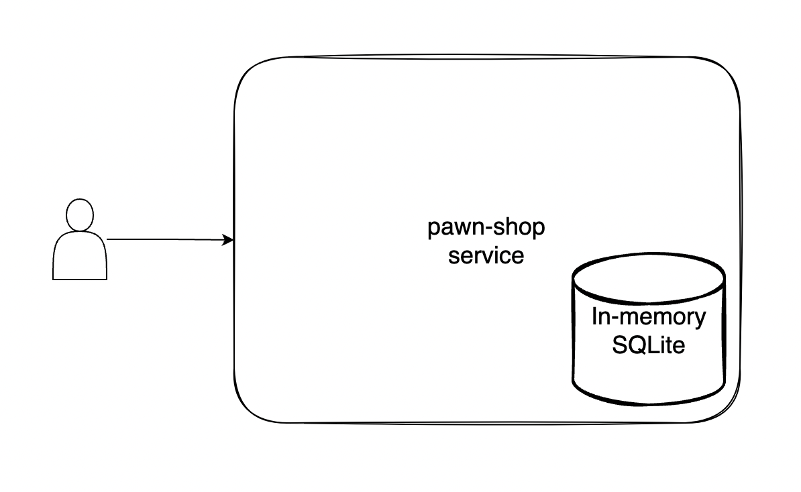
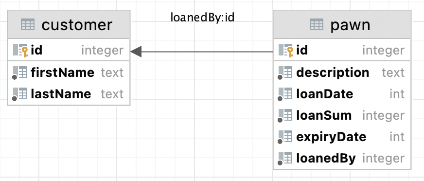
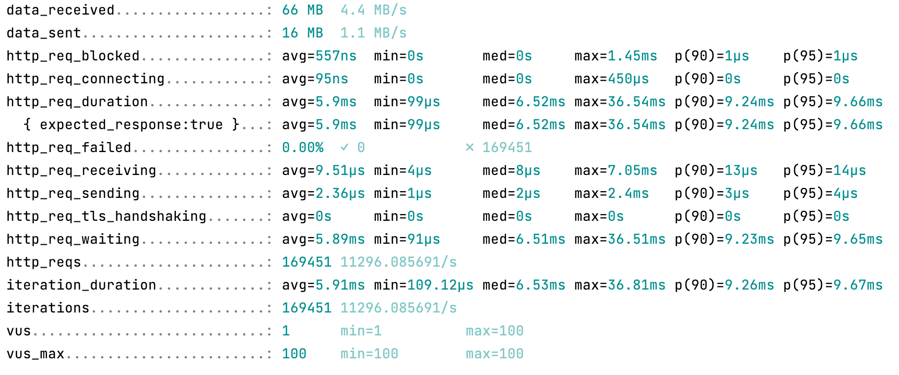
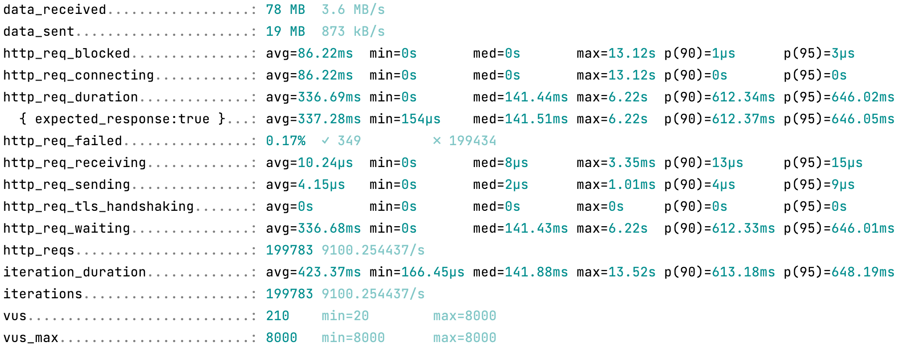
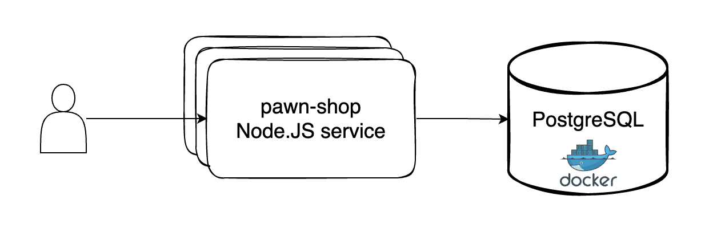
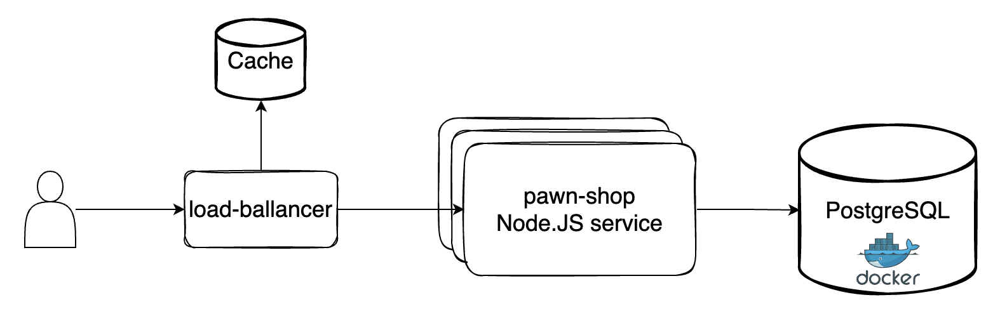

# Info Pawn Shop

#### This application has been created for the following assignment:

1. Create an application (which can be used as a microservice) using (use witch ever you want) Javascript / Typescript (
   LTS version)
2. Inside this application create functionality to manage the following logical data model:
    - A Customer has at least a unique id, a first name and a last name
    - A Pawn has at least a unique id, a loan date, a loan sum and an expiry date
    - The pawn loan date is set to the date when the pawn is created (=loaned).
    - The pawn expiry date is always 9 months after the loan date (no need to take weekdays and national holidays into
      account)
    - A Pawn always has an associated Customer
    - A Customer can have 0..n Pawns
    - A loan sum is a whole number and must be at least 100

3. When starting up the application there should be some customers automatically added to the database. There should be
   no pawns.
4. Create an endpoint (e.g. REST or GraphQL) with which a specific customer can loan a pawn with a specified loan sum
    - After calling this endpoint the database should contain a pawn which is associated to the customer in question.
    - If the specified loan sum is lower than 100 the endpoint should return an error response.
5. The project can be built by a developer that has the LTS version of your chosen language without the need to install
   additional software.

## My Solution

## Architecture



Because of the "The project can be built by a developer that has the LTS version of your chosen language **without the
need to install additional software**" assignment conditions and time constraints, I went with a database, embedded into the service. Please
look at the [Next Steps: Architecture](#1-architecture) chapter for an improved architecture proposal.

The scalability of this architecture is tested in the [Performance chapter](#running-performance-tests) 

### Database Schema



## Installing

1. Install Node.JS version 16.x either via https://nodejs.org/en/download/ or [nvm](https://github.com/nvm-sh/nvm)
2. From the project root directory run

```shell
npm install
```

## Running

Run in development mode:

```shell
npm run dev
```

Run in production mode(disables error stack trace, **swagger** and **exportDB** routes (
see [API Documentation](#api-reference)))

```shell
npm run dev
```

## API Reference

For the API documentation I went with OpenAPI/Swagger because of the interactivity and ease of use. To open the
documentation run:

```shell
npm run dev
```

The documentation page will be automatically opened in the browser(http://localhost:3210/api/v1/swagger/).

## Testing

The test suite for this app is constituted mix of:
   - [Unit](#running-integration-and-unit-tests) (found in ***info-pawn-shop/test/unit***)
   - [Integration](#running-integration-and-unit-tests) (found in ***info-pawn-shop/test/integration***)
   - [Performance](#running-performance-tests) (found in ***info-pawn-shop/test/integration***) (Running these tests requires [k6](https://k6.io/docs/getting-started/installation/). I know it's something that violates the **"without the need to install
     additional software"** clause of the assignment, but k6 is too good to not use ☺️)
### Running Integration and Unit tests
```shell
npm run test
```

### Running Performance tests

**Smoke Test:** Sanity check

```shell
k6 run test/performance/smokeTest.js
```

**Load Test:** determine the service's throughput

```shell
k6 run test/performance/loadTest.js
```

(*as tested on a 10 core M1 Macbook*)

Looking at our results we can see that the app can comfortably handle around 11k requests per second

**Stress Test:** examine the service's availability and performance at extreme load

```shell
k6 run test/performance/stressTest.js
```

(*as tested on a 10 core M1 Macbook*)

From these results we can see that our app starts to drop some requests at significant load( around 0.2% of our total requests), we could better this by improving the architecture. See [Next Steps: Architecture](#1-architecture)

**Soak Test:** examine the service's performance at a constant prolonged load

```shell
k6 run test/performance/soakTest.js
```

## Next Steps!

### 1. Architecture

We could easily scale up to 80k+ requests per second(the transaction limit of a PG instance as tested on a 10 core M1
Macbook) of this app with simply dockerizing our database, and creating a pool of our Node.JS service.

And if this is not enough, we could add a request cache, between the user and the service. This would allow us to easily
scale up to 250k requests per second(https://redis.io/topics/benchmarks)


### 2. Code scalability and documentation

We could change the express routers out with [routing-controllers](https://github.com/typestack/routing-controllers),
this would achieve two things:

1. Make our route code imperative and easier to understand(subjectively)
2. Allow us to automatically generate most of the OpenAPI/Swagger documentation
   with [routing-controllers-openapi](https://github.com/epiphone/routing-controllers-openapi). This would significantly
   reduce the time spent on documenting as the project grows.

### 3. Testing

Write more tests to cover the application's codebase better

### 4. Pagination
With the current setup we could get away without it, but as the project grows fetching all Customers or Pawns for each request would bog the service down. That's why spending time to implement pagination is important.